# Báo cáo: Sinh ảnh 2D từ scan 3D mộc bản

Code: `src/`. Notebook Kaggle: `notebooks/mocban_scan3d_kaggle.ipynb`. Kiểm tra: `tests/`. Hình: `assets/`. Scan: `input/`.
Cài đặt và cách chạy: [README.md](README.md). Bối cảnh và lịch sử dự án: [CONTEXT.md](CONTEXT.md).

---

## 1. Tóm tắt

**Bài toán.** OCR mộc bản thiếu dữ liệu huấn luyện, trong khi ảnh chụp thật rất đa dạng về góc chụp, ánh sáng, bóng
đổ và vật che. Chụp thêm thì tốn công mà không bao quát hết các trường hợp.

**Ý tưởng.** Từ **một scan 3D** của khối mộc bản, sinh số lượng ảnh 2D tuỳ ý ở mọi góc chụp và điều kiện ánh sáng.
Mọi tham số đều có kiểm soát và được ghi lại cho từng ảnh.

**Phạm vi:**
- Chỉ dùng **scan 3D thật**.
- Giả định mỗi scan **chỉ có một mặt mang thông tin** (mặt khắc). Chưa xử lý khối khắc hai mặt.

**Kết quả:**

| Khối | Làm gì | Đầu ra |
|---|---|---|
| **Bước chung** | Nhận scan bất kỳ (GLB/GLTF/OBJ/STL/PLY, đặt nghiêng tuỳ ý, texture nhúng hoặc ảnh rời), **tự tìm mặt khắc**, xoay mặt khắc về phía camera, không bao giờ lật gương | Mesh ở tư thế chuẩn, ảnh soát, `audit.csv` |
| **Hướng A: giả ảnh chụp** | Render có texture, đèn, bóng đổ, hiệu ứng máy ảnh và vật che. Cần GPU | Ảnh JPG + `meta.json` |
| **Hướng B: tăng cường hình học** | Chiếu scan thành ảnh độ sâu ở góc bất kỳ, làm nổi nét khắc bằng 6 phương pháp, **không dùng đèn**. Chỉ cần CPU | Ảnh PNG + `batch_meta.json` |

Cả ba khối nằm trong **một notebook Kaggle**. Máy không có GPU thì notebook tự bỏ qua hướng A, hướng B vẫn chạy.

**Mức độ tin cậy:**
- Phép chiếu 3D → 2D được kiểm chứng bằng các bài toán có đáp án giải tích (mục 6.3).
- Chạy trên scan thật phát hiện và sửa được 9 lỗi (mục 8), trong đó có lỗi hố giả của phép chiếu và lỗi ảnh xám trên Kaggle.
- **Toàn bộ kết quả mới dựa trên 1 scan thật, và scan đó không có chữ.** Các ngưỡng đều là giá trị đặt thử (mục 9).

## 2. Dữ liệu

Hiện không có scan mộc bản Hán-Nôm nào công khai. Scan thật dùng trong báo cáo:

| Thuộc tính | Giá trị |
|---|---|
| Nguồn | một scan công khai của bảo tàng, giấy phép cho phép dùng lại |
| Định dạng | OBJ không có `.mtl`, **715 nghìn đỉnh / 1,42 triệu tam giác**, texture 4K `.jpg` rời, kèm normal map |
| Hình dạng | khối dẹt, tỉ lệ cạnh ≈ 200 : 192 : 47 (sau khi đưa cạnh dài về 200 mm). Trong file, khối **đặt nghiêng**, nên hộp bao theo trục toạ độ đọc ra 200 × 155 × 178 |
| Nội dung | mặt trước khắc hoa văn (cây, ô trám, chữ thập), nứt đôi dọc giữa. Mặt sau có 2 hốc tay cầm và một nhãn dán. **Không có chữ** |

Khi thử khả năng đọc định dạng khác, mình dùng **chính scan trên** đổi sang GLB (đơn vị mét, texture nhúng trong file).
Bản GLB này **không phải scan độc lập**.

## 3. Luồng xử lý

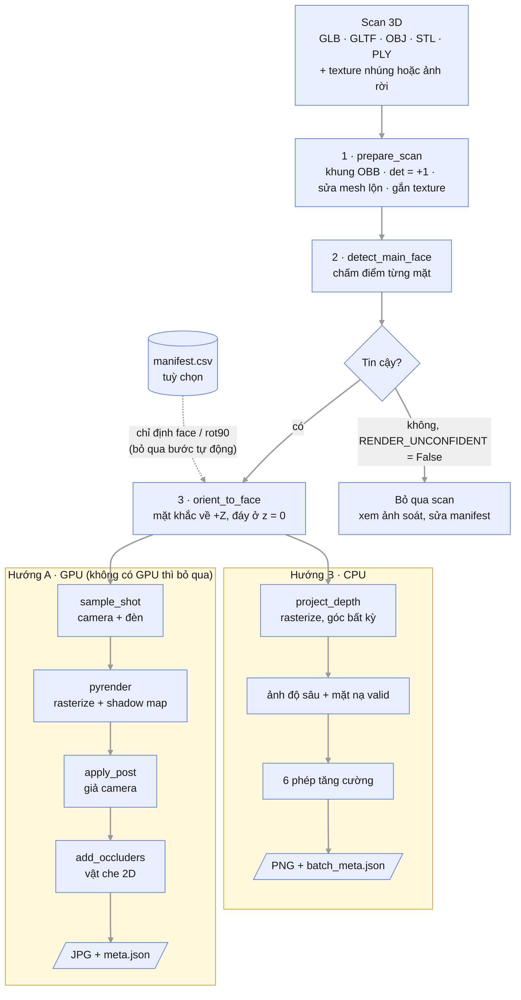

| File | Vai trò |
|---|---|
| `src/core/mocban_render/` | Bước chung + hướng A, tên file `sNN_` theo thứ tự pipeline: `s01_scan.py` (nạp scan, texture, khung OBB) → `s02_face.py` (tìm mặt khắc, manifest) → `s03_shot.py` (lấy mẫu camera/đèn) → `s04_camera.py` (ma trận pose) → `s05_renderer.py` (pyrender) → `s06_post.py` (hậu kỳ, vật che) → `s07_dataset.py` (vòng sinh ảnh, soát) |
| `src/core/mocban_enhance/` | Hướng B, tên file `sNN_` theo thứ tự pipeline: `s01_projection.py` (chiếu 3D → ảnh độ sâu) → `s02_height.py` → `s03_derivatives.py` → `s04_depth.py` → `s05_curvature.py` → `s06_msii.py` → `s07_ao.py` → `s08_shading.py` → `s09_display.py` → `s10_grid.py` |
| `notebooks/build_notebook.py` + `notebook_docs.py` → `mocban_scan3d_kaggle.ipynb` | Sinh notebook Kaggle (mục 7) |
| `src/run/run_smoke.py` | Render ở máy local từ dòng lệnh |
| `src/run/audit_scans.py` | Soát mặt khắc cho cả thư mục scan → ảnh soát + `audit.csv` |
| `tests/check_face_detection.py` | Kiểm tra độ ổn định của bước tìm mặt khắc khi xoay scan ngẫu nhiên |

**Tham số đặt ở đâu:**
- Tham số có tên viết HOA (ví dụ `N_SHOTS`, `AO_R_PX`) nằm ở **cell cấu hình** của notebook, sửa trực tiếp ở đó.
- Tham số ghi "cố định" nằm trong hàm. Muốn đổi thì phải sửa module rồi build lại notebook.

---

## 4. Bước chung: chuẩn hoá scan và tìm mặt khắc

### 4.1 Chuẩn hoá scan (`prepare_scan`)

Scan tải về có đơn vị, vị trí và hướng tuỳ ý. Bước này đưa mọi scan về cùng một khung toạ độ để các bước sau dùng chung
một bộ tham số.

1. **Đọc file** với `process=False` để giữ toạ độ UV. Không dùng `force="mesh"`, vì tuỳ chọn này làm mất texture và cho
   ra ảnh xám. Scene nhiều node được gộp bằng `to_mesh()`, có áp phép biến đổi của từng node.
2. **Tìm texture rời.** Nếu mesh có UV mà không kèm ảnh, pipeline tìm ảnh có tiền tố tên khớp dài nhất với tên mesh:
   - tìm trong thư mục của mesh, thư mục ngang hàng, và lên tối đa 3 cấp thư mục; ở vòng tìm xa thì bắt buộc phải khớp
     tiền tố tên (≥ 4 ký tự), để không nhặt nhầm texture của scan khác;
   - bỏ ảnh normal, AO, roughness…;
   - bỏ ảnh nhỏ hơn 16 px, vì trimesh tự tạo ảnh giả 2×2 cho OBJ không có `.mtl`;
   - nhiều ảnh khớp ngang nhau thì không đoán. Khi đó ghi tên ảnh vào cột `texture` của `manifest.csv`.
3. **Mesh lộn trong ra ngoài** (pháp tuyến hướng vào trong) được phát hiện bằng tổng `Σ area·(n·r̂)/|r|` rồi lật lại.
   Ngưỡng −0,2 (cố định): chỉ lật khi đa số pháp tuyến rõ ràng hướng vào trong.
4. **Khung OBB.** Dùng hộp bao định hướng (OBB) thay cho hộp bao theo trục (AABB), vì scan có thể đặt nghiêng. Ma trận
   quay bị **ép det = +1** nên khối không bao giờ bị lật gương. Lật gương sẽ làm chữ khắc bị đảo chiều.
5. **Scale** cho cạnh dài nhất = `TARGET_MM` (mặc định 200 mm, cỡ một khối mộc bản thường gặp). Nếu biết kích thước thật
   của khối thì đặt đúng số đó, để các số đo mm (ví dụ độ sâu nét) là số thật. Ma trận biến đổi từ toạ độ file sang khung
   chuẩn được lưu trong `metadata` để truy ngược.

Tên mặt: **A, B, C** là 3 trục OBB xếp theo độ dài giảm dần; C là chiều dày. Mỗi trục có hai mặt `+` và `−`, ví dụ `C+`, `C-`.

### 4.2 Tự tìm mặt khắc (`detect_main_face`)

**Ý tưởng.** Mặt khắc là mặt có **chi tiết nhỏ phủ kín** (nét chữ, hoa văn). Mặt lưng phẳng, cùng lắm có vài hốc lớn.
Vì vậy đo "độ chi tiết" của từng mặt rồi chọn mặt cao nhất.

**Cách làm:**
1. Nếu `C/B ≤ 0,6` (khối dẹt) thì chỉ so hai mặt lớn `C+`, `C-`. Nếu không thì so cả 6 mặt.
2. Nhìn thẳng vào từng mặt bằng Z-buffer trực giao để có ảnh độ cao `h`. Bước lưới
   `px = max(L/400, 0,7·√(2·S/N_tam_giác))`, với L là cạnh dài nhất và S là diện tích bề mặt; khối 200 mm cho khoảng 0,5 mm.
3. Tính hai đại lượng:
   - **Độ phủ (coverage)**: tỉ lệ diện tích mặt có dữ liệu scan, đo sau **phép đóng** hình thái 3×3 × 3 lần. Không dùng
     phép giãn, vì phép giãn làm mảnh vụn phình to và tính sai độ phủ.
   - **Độ chi tiết (detail)**:
     ```
     top    = lớp mặt ngoài: h > p90(h) − 0,075·L, co vào 2,5 %·L để bỏ mép
     detail = median | h − G_σ * h |  trên top,   σ = 1 %·L = 2 mm
     ```

**Vì sao dùng trung vị.** Đã thử hai cách khác trên scan thật và cả hai đều chọn sai:
- độ lệch chuẩn của phần dư cao tần chọn nhầm **mặt lưng**, vì mép hai hốc tay cầm rất sâu kéo độ lệch chuẩn lên;
- độ nhám bề mặt (rugosity) chọn nhầm một **mặt cạnh** mỏng.

Trung vị chỉ cao khi chi tiết phủ **khắp** mặt.

**Quy tắc quyết định** (các ngưỡng cố định trong code):

| Ngưỡng | Giá trị | Ý nghĩa |
|---|---|---|
| `FACE_THIN_RATIO` | 0,6 | `C/B ≤ 0,6` là khối dẹt, mặt khắc chắc chắn là một trong hai mặt lớn |
| `FACE_MIN_COVERAGE` | 50 % | Chỉ xếp hạng mặt có đủ dữ liệu. Mảnh vụn cho độ chi tiết cao giả tạo: đã gặp 1,12 mm ở độ phủ chỉ 14 % |
| `FACE_MIN_RATIO` | 2,0 | Kết quả **tin cậy** khi `detail(mặt chọn) / detail(mặt thứ nhì) ≥ 2`… |
| `FACE_MISSING` | 15 % | …hoặc khi mặt đối diện có độ phủ < 15 %, tức scan chỉ quét một mặt |

Không đạt điều kiện nào thì pipeline vẫn trả mặt đoán tốt nhất nhưng đánh dấu **cần soát**.

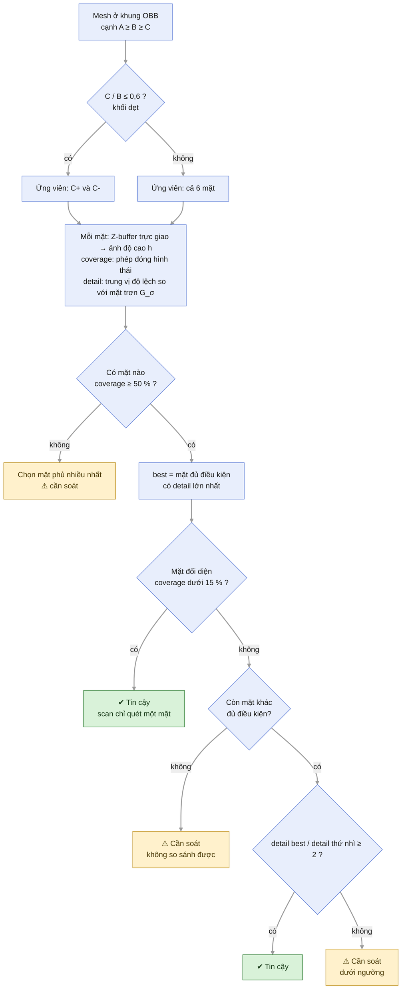

**Xoay khối (`orient_to_face`).** Mặt khắc được xoay về +Z, cạnh dài còn lại nằm dọc trục X, rồi xoay thêm
`rot90 × 90°` nếu có chỉ định. Phép biến đổi luôn là phép quay thật (det = +1). Hướng 0° hay 180° trong mặt phẳng
(khối lộn đầu) **không suy ra được từ hình học**, nên khi cần phải chỉnh tay bằng `rot90`.

### 4.3 Kết quả trên scan thật

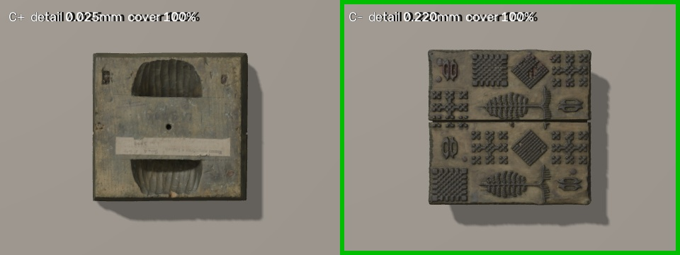

*Hình 1: Ảnh soát, nhìn thẳng từng mặt ứng viên. Khung xanh là mặt được chọn và tin cậy. `C+` là mặt lưng (hai hốc tay
cầm, nhãn dán); `C-` là mặt khắc.*

| Mặt | detail (mm) | Độ phủ | Kết quả |
|---|---|---|---|
| C- (mặt khắc) | **0,220** | 100 % | **được chọn, tin cậy** |
| C+ (mặt lưng) | 0,025 | 100 % | |
| Tỉ số | **8,7×** | | ngưỡng 2× |

- **Chế độ dẹt** (C/B ≈ 0,24) cho biên độ 8,7×. Nếu ép so cả 6 mặt thì biên độ chỉ còn **2,1×**, vì mặt cạnh là thớ gỗ
  đầu cây khá nhám. Quy tắc "khối dẹt chỉ so hai mặt lớn" vì vậy là cần thiết.
- **Độ ổn định** (`check_face_detection.py`): xoay scan ngẫu nhiên 6 lần rồi chạy lại. Hướng mặt khắc lệch tối đa
  **0,72°**, **không lần nào lật gương**, 6/6 lần tin cậy, tỉ số detail nằm trong 8,25–8,90.
- **Bộ kiểm thử 13 ca, tất cả đạt** (chạy trong quá trình phát triển, chưa đưa vào `tests/`). Các ca đều là biến thể
  dựng từ chính scan này: tự tìm đúng texture màu (không nhận
  nhầm normal map), bất biến khi xoay, ép chế độ 6 mặt, cắt bỏ nửa sau để giả scan chỉ quét một mặt, mesh lộn trong ra
  ngoài, bản GLB đơn vị mét, chỉ định mặt bằng tay.

### 4.4 Soát và sửa tay bằng `manifest.csv`

1. Chạy `audit_scans.py --scans <thư mục>` (hoặc mục soát của notebook). Kết quả gồm ảnh soát `<tên>_faces.jpg` cho
   mỗi scan và file `audit.csv` với các cột `mesh, texture, face, rot90, confident, reason, ratio, auto_face, has_texture, scores`.
2. Xem các dòng `confident=False`, sửa cột `face` / `rot90` / `texture` theo ảnh soát.
3. Lưu thành `manifest.csv`. Notebook và `run_smoke.py --manifest` chỉ đọc 4 cột `mesh, texture, face, rot90`, cột thừa
   bị bỏ qua. Khoá của mỗi dòng là **tên file mesh**, không kèm đường dẫn, nên cùng một manifest dùng được cả ở máy local
   lẫn trên Kaggle. Vì vậy tên file mesh trong một dataset không được trùng nhau.

Mặc định (`RENDER_UNCONFIDENT = False`), scan chưa chắc mặt khắc bị **bỏ qua** thay vì render sai mặt.

---

## 5. Hướng A: render giả ảnh chụp

**Ý tưởng.** Mô phỏng người chụp ảnh mộc bản trong nhiều tình huống: chụp lưu trữ, chụp tay, đèn xiên, chụp cận. Mỗi ảnh
bốc ngẫu nhiên một tình huống, rồi thêm các khuyết điểm của máy ảnh thật.

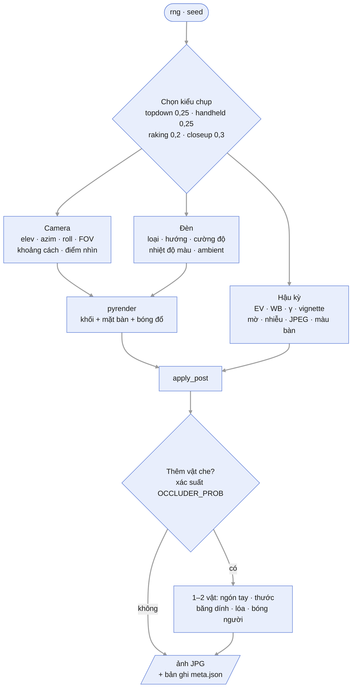

### 5.1 Renderer (`PyrenderBackend`)

Rasterize bằng OpenGL (pyrender), vật liệu PBR, bóng đổ bằng shadow map cho đèn directional/spot.

| Tham số | Giá trị | Vì sao |
|---|---|---|
| `RENDER_W, RENDER_H` | 1600 × 1200 | Cỡ ảnh chụp thường gặp, đủ nét để thấy chi tiết khắc |
| `N_SHOTS` | 24 ảnh mỗi scan | Đủ trộn 4 kiểu chụp để xem thử; tăng lên khi sinh dữ liệu thật |
| Vật liệu (cố định) | roughness 0,6, metallic 0 | Gỗ thấm mực: hơi bóng, không phải kim loại |
| Pháp tuyến (cố định) | theo từng tam giác (`smooth=False`) | Giữ mép nét khắc sắc, không bị làm tròn |
| Mặt bàn (cố định) | rộng gấp 4 lần khối, dày 1 mm | Hứng bóng đổ ở mọi góc đèn |
| Camera (cố định) | `znear` 5 mm, `zfar` 5000 mm | Bao trọn mọi khoảng cách chụp |

**Tốc độ (máy local):** nạp scan 1,42 triệu tam giác mất 17–23 s. Mỗi ảnh 1600 × 1200 render mất khoảng 0,6 s. Lưu ý:
máy có GTX 1660 Ti nhưng `run_info.json` cho thấy OpenGL thực ra chạy trên GPU tích hợp **Intel UHD 630**; con số này là
của GPU tích hợp. Đo lại có tách thời gian dựng cảnh: dựng cảnh 1,8 s, render 0,93 s/ảnh ở 800 × 600.

Texture được gắn qua `TextureVisuals(uv, image)`, vì pyrender không đọc `PBRMaterial` của trimesh 5.

### 5.2 Bốn kiểu chụp (`sample_shot`, tham số `PRESET`)

`PRESET = "mixed"` bốc ngẫu nhiên theo trọng số trong bảng. Cũng có thể đặt cố định một kiểu.

| Kiểu (trọng số) | Tình huống | Góc camera `elev` | FOV | Khối chiếm khung | Đèn chính | Ambient |
|---|---|---|---|---|---|---|
| topdown (0,25) | chụp lưu trữ, máy gần vuông góc | 78–90° | 30–45° | 0,75–0,95 | directional, cao 50–80°, cường độ 2–4 | 0,25–0,5 |
| handheld (0,25) | cầm máy chụp nghiêng | 45–78° | 40–65° | 0,7–1,0 | 50 % **flash gần camera**, 50 % đèn phòng; 40 % có thêm nguồn phụ 6500 K (cửa sổ) | 0,1–0,35 |
| raking (0,2) | đèn xiên để nổi nét | 55–88° | 32–50° | 0,75–1,0 | directional **xiên thấp 10–30°**, cường độ 3–6 → bóng dài | 0,12–0,3 |
| closeup (0,3) | chụp cận một vùng | 60–90° | 30–45° | **2–4×** (chỉ thấy một phần khối, điểm nhìn lệch tới ±35 %) | directional 25–80°; 50 % có nguồn phụ | 0,15–0,4 |

**Chung cho mọi kiểu** (cố định):

| Tham số | Giá trị | Vì sao |
|---|---|---|
| Phương vị camera | 0–360° đều | Chụp từ mọi phía |
| Xoay trong khung (roll) | 80 % gần thẳng `N(0, 4°)`; 20 % xoay 90/180/270° cộng nhiễu | Ảnh lưu trữ phần lớn đặt thẳng; một phần ảnh chụp vội bị xoay |
| Hướng "lên" của ảnh | gắn với trục +Y của khối | Khối không đột ngột đổi hướng khi nhìn gần thẳng xuống (`elev` ≈ 80°) |
| Khoảng cách | `(đường chéo khối / tỉ lệ chiếm khung) / (2·tan(FOV/2))` | Khối chiếm đúng tỉ lệ khung mong muốn ở mọi FOV |
| Nhiệt độ màu | 3000 / 4000 / 5000 / 5600 / 6500 K | Từ đèn sợi đốt (vàng) tới ánh sáng ngày (trắng) |
| Màu mặt bàn | giấy trắng, gỗ, vải xám, nền tối, be | Nền chụp thường gặp |

Góc camera không xuống dưới 45° là lựa chọn thiết kế: nhìn thấp hơn thì mặt khắc bị co ngắn mạnh, bóng che nhiều, nét
gần như không đọc được, nên ảnh loại đó ít giá trị cho huấn luyện.

### 5.3 Hậu kỳ giả camera (`apply_post`)

Ảnh render quá "sạch", nên bước này thêm các khuyết điểm của máy ảnh thật theo đúng thứ tự xảy ra trong máy:

| Bước | Công thức | Khoảng giá trị | Vì sao |
|---|---|---|---|
| Phơi sáng | `img · 2^EV` | EV −0,4 … +0,5 | Thiếu / thừa sáng nhẹ |
| Phơi sáng tự động tối thiểu | độ sáng trung bình < 0,14 thì tăng EV cho đủ | 0,14 | Máy ảnh thật tự nâng ISO, không để ảnh gần đen hoàn toàn (hay gặp khi đèn xiên thấp) |
| Cân bằng trắng | nhân kênh R và B | ±5 % | Lệch màu nhẹ giữa các máy |
| Gamma | `img^γ` | γ 0,9–1,15 | Đường cong tông khác nhau |
| Tối góc | `img · (1 − v·r²)`, r là khoảng cách chuẩn hoá tới tâm ảnh | v 0–0,35 | Ống kính tối dần ra mép |
| Mờ | Gauss | σ ~ `max(0, N(0,3; 0,4))` px | Lệch nét, rung tay; phần lớn ảnh chỉ mờ nhẹ |
| Nhiễu cảm biến | Poisson-Gauss: `σ_pixel = s·(0,6 + 1,2·√(1 − L))`; thêm nhiễu màu ở vùng L < 0,3 | s 0–0,03 | Vùng tối nhiễu mạnh hơn, đúng như ảnh ISO cao |
| Nén JPEG | mã hoá rồi giải mã | chất lượng 55–95 | Vết khối 8 × 8 của JPEG thật |

### 5.4 Vật che (`add_occluders`, tham số `OCCLUDER_PROB`)

Mỗi ảnh có xác suất `OCCLUDER_PROB` được thêm 1–2 vật che, tỉ lệ ngón tay 3 : thước 2 : băng dính 2 : lóa 2 : bóng 2.

| Loại | Cách vẽ | Tính vào `occluded_frac`? |
|---|---|---|
| Ngón tay | 1–2 ellipse màu da (3 tông) từ mép ảnh, có bóng mềm | có |
| Thước | dải vàng hoặc trắng gần mép | có |
| Băng dính | chữ nhật xanh hoặc trắng | có |
| Lóa flash | đốm sáng mềm | không: bề mặt vẫn thấy một phần |
| Bóng người chụp | dải tối mềm | không |

Mặc định `OCCLUDER_PROB = 0` (sinh ảnh sạch). Đặt 0,3–0,5 khi muốn mô hình quen với tay hoặc thước trong ảnh.
`occluded_frac` được ghi vào meta để lọc nhãn sau này.

### 5.5 Đầu ra và kết quả

Mỗi scan cho ra `<tên>_XXXX.jpg` và `<tên>_meta.json`. Mỗi bản ghi trong meta gồm toàn bộ tham số của lần chụp (camera,
đèn, ambient, hậu kỳ), ma trận pose camera, loại vật che, `occluded_frac` và `face_info` (mặt khắc, lý do chọn, điểm từng
mặt). Nhờ vậy mọi ảnh đều tái tạo và truy vết được.

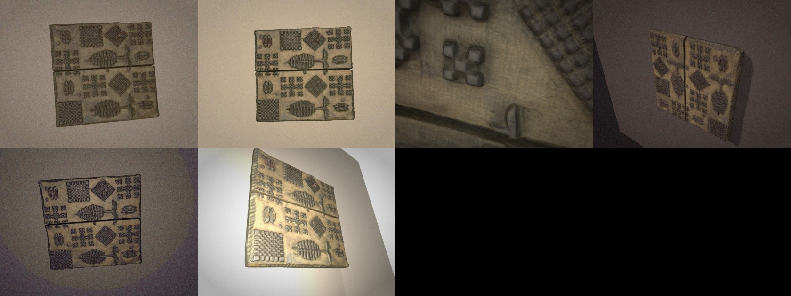

*Hình 2: Render từ scan thật, `PRESET = "mixed"`, 1600 × 1200: nhìn gần thẳng, cận cảnh, đèn xiên, góc nghiêng.*

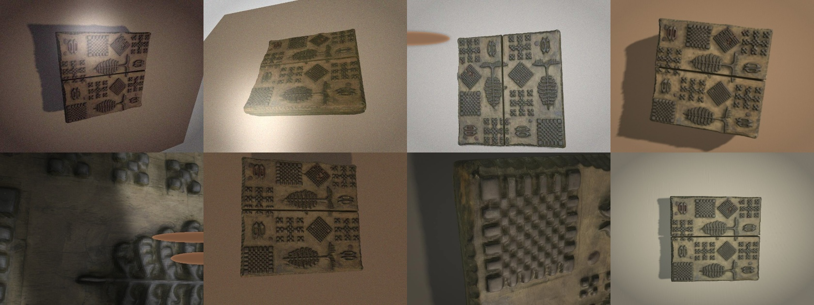

*Hình 3: Render có vật che (`OCCLUDER_PROB = 1`): ngón tay, lóa flash, bóng người chụp.*

**Nhận xét:**
- Nhờ texture của scan thật (vân gỗ, vết mực cũ), ảnh trông giống ảnh chụp.
- Khung đèn xiên thấp hoặc góc chụp thấp có thể thấy cạnh khối và bị tối. Hiện tượng này đúng với thực tế. Muốn nhiều khung
  thấy rõ mặt khắc thì chọn `PRESET = "topdown"` hoặc `"closeup"`.
- **Chưa có phép đo định lượng độ giống thật** so với ảnh chụp mộc bản thật (mục 9).

---

## 6. Hướng B: tăng cường hình học, không dùng đèn

**Vì sao cần.** Mọi cách chụp hay render dựa vào đèn đều có cùng điểm yếu: đèn thấp thì ảnh tối và nét khắc biến mất.
Hướng B đọc nét khắc **trực tiếp từ hình dạng 3D**, nên đọc được ở mọi góc. Hướng này chỉ cần CPU (`trimesh, numpy, scipy, cv2`).

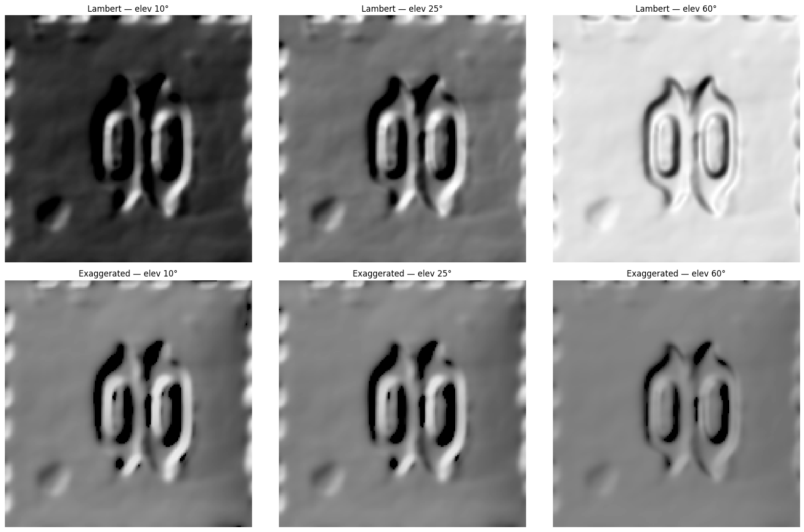

*Hình 4: Hàng trên là đèn thường (Lambert) ở độ cao đèn 10°, 25°, 60°; hàng dưới là exaggerated shading (mục 6.4).
Đèn thường gần như tối hẳn ở 10°, còn exaggerated gần như không đổi.*

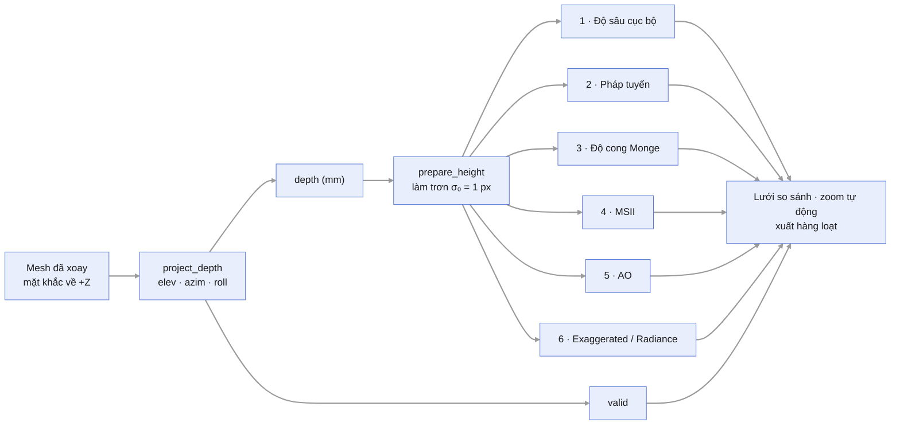

### 6.1 Chiếu 3D → ảnh độ sâu (`project_depth`)

**Ý tưởng.** Nhìn khối từ một góc, mỗi pixel ghi độ cao của bề mặt gần camera nhất. Mọi phương pháp phía sau chạy trên
ảnh độ sâu này bằng xử lý ảnh thông thường, nhanh hơn nhiều so với tính trên mesh hàng triệu tam giác.

- **Hệ trục camera** `(s, u, f)` dùng cùng quy ước `look_at_pose` với hướng A. Với mỗi đỉnh V: `X = V·s`, `Y = V·u`,
  `D = −V·f`; D lớn nghĩa là gần camera.
- **Chiếu trực giao** ở góc bất kỳ (`elev`, `azim`, `roll`).
- **Bước lưới `PX_MM`.** Mặc định `None` = độ phân giải gốc của scan:
  `px = √(diện tích chiếu của phần bề mặt quay về camera / số đỉnh của phần đó)`, tức 0,32 mm/px ở scan mẫu. Lưới mịn
  hơn mức này chỉ là nội suy trên tam giác phẳng, không thêm thông tin. Đặt số cụ thể khi cần nhiều scan có cùng độ phân giải.
- **Rasterize tam giác** (`_raster_zbuffer`). Mỗi pixel (r, c) lấy độ sâu **đúng tại tâm pixel** `(c + 0,5; r + 0,5)`:
  nội suy barycentric, chọn tam giác **cao nhất** trong các tam giác chứa tâm đó, rasterize **mọi** tam giác và **không
  lọc theo pháp tuyến**. Code được vector hoá bằng cách nhóm tam giác theo cỡ hộp bao và chia khối để giới hạn bộ nhớ.
- **Mặt nạ `valid`**: pixel có bề mặt, sau một phép đóng 3×3 để lấp lỗ kim. `valid = False` là nền ngoài khối, lỗ thủng
  lớn của scan, hoặc vùng bị che khuất thật khi nhìn xiên. Các pixel này được **tô đen** trong ảnh xuất, không lấp giả.

### 6.2 Lỗi hố giả khi chiếu bằng cách rải điểm

Bản đầu tiên chiếu bằng cách **rải đỉnh (splat)**: mỗi đỉnh rơi vào một pixel, pixel giữ đỉnh cao nhất. Trên mesh thử
nghiệm kết quả vẫn đúng, nhưng trên scan thật ảnh bị **chi chít chấm lỗ sâu 14–35 mm**, xếp thành một đường chạy ngang mặt khắc.

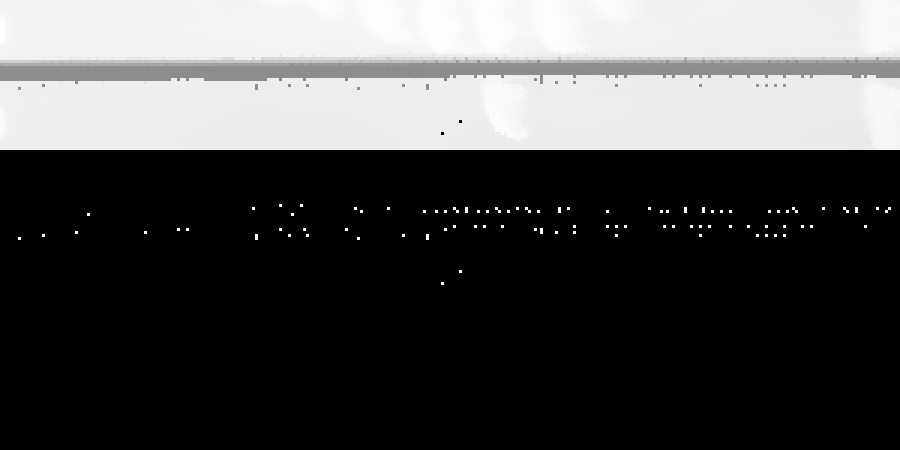

*Hình 5: Hố giả của phép rải điểm. Trên: ảnh độ sâu; dưới: mặt nạ các pixel bị hố.*

**Nguyên nhân** (đã kiểm chứng bằng phép thử điểm-trong-tam-giác):
- Scan có **nhiều lớp bề mặt chồng nhau**: 2–4 lớp dưới nhiều pixel.
- Khoảng **9 % tam giác mặt ngoài bị lật pháp tuyến**.
- Rải điểm để lại khe ngẫu nhiên. Ở pixel không nhận được điểm nào của mặt ngoài, một lớp nằm **dưới** thắng Z-buffer và
  tạo ra hố giả.
- Thêm bước lọc mặt sau theo pháp tuyến vẫn không hết lỗi, vì 9 % tam giác bị lật pháp tuyến của mặt ngoài cũng bị lọc theo.

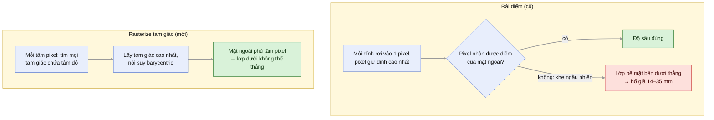

**Cách sửa:** rasterize tam giác tại tâm pixel như mục 6.1. Ở đâu mặt ngoài phủ tâm pixel thì lớp dưới không bao giờ
thắng được. Đo lại:

| Chỉ số | Rải điểm (cũ) | Rasterize (mới) |
|---|---|---|
| Pixel bị bộ dò hố gắn cờ, nhìn thẳng 90° (thấp hơn trung vị 5×5 quá 1,5 mm) | 871 | **32** |
| Hố cô lập thật sự (thấp hơn cả hai phía theo cả hai trục), ở 90° / 70° / 50° | – | **0 / 0 / 0** |
| Sai số trên mặt sin có đáp án (mục 6.3) | 0,031 mm | **0,006 mm** |
| Độ sâu nét khắc điển hình (p5–p95 của độ sâu cục bộ) | 6,2 mm (bị hố thổi phồng) | **≈ 2,5–2,6 mm** |

Ở góc 50°, bộ dò hố gắn cờ 847 pixel, nhưng không pixel nào là hố cô lập: tất cả là **bậc độ sâu một phía** ở mép che
khuất. Khi nhìn xiên, phía sau gờ nổi là mặt thấp hơn, nên bậc này là hình học đúng chứ không phải lỗi.

### 6.3 Kiểm chứng giải tích

Các bài kiểm nằm trong notebook dưới dạng cell `assert`; sai là notebook dừng.

| Bài kiểm | Đáp án | Đo được |
|---|---|---|
| Mặt sin `z = sin(2πx/20)·cos(2πy/15)`, lưới 0,5 mm, nhìn 90° | sai số bị chặn bởi sai số nội suy tuyến tính ≤ 0,0171 mm | median **0,0059**, max **0,0085 mm** |
| Mặt phẳng nhìn xiên `elev = 60°` | độ dốc độ sâu theo cột = `px / tan(elev)` = 0,28868; theo hàng = 0; rộng 174 cột | 0,28862 (lệch **0,020 %**); 0,000000; 174 cột |
| Mặt phẳng nhìn xiên `elev = 30°` | 0,86603; 0; 101 cột | 0,86552 (lệch **0,058 %**); 0,000000; 101 cột |

Ngoài ra còn các bài kiểm cho từng phương pháp tăng cường: bán cầu `H = −1/R`, `K = +1/R²`; mặt phẳng `AO = 1`,
`v_r = ½`; chân tường đứng `AO ≈ 0,5`; MSII khớp khai triển Pottmann; ba tính chất của hàm scaling Möbius.
Tổng cộng 20 bài kiểm, tất cả đạt.

**Trên scan thật:**

| Góc nhìn | Bước lưới | Kích thước ảnh | Pixel `valid` | Thời gian chiếu |
|---|---|---|---|---|
| 90° | 0,321 mm/px (tự động) | 597 × 625 | 98,8 % | 1,7 s |
| 70° | | | 93,9 % | |
| 50° | 0,285 mm/px | 756 × 609 | 84,1 % | 1,4 s |
| 30° | | | 77 % | |

### 6.4 Sáu phương pháp tăng cường

Ký hiệu: `h` là độ cao (mm) trên lưới bước `px_mm`; `p = h_x`, `q = h_y` là độ dốc; `r = h_xx`, `s = h_xy`, `t = h_yy`
là đạo hàm bậc hai.

**Làm trơn trước khi tính (`prepare_height`).** Ảnh độ sâu ghép từ tam giác phẳng, cộng nhiễu đo. Lấy đạo hàm trực tiếp sẽ
hiện lưới tam giác và hạt nhiễu, nên trước mọi phép đạo hàm đều làm trơn nhẹ `SIGMA0_PX = 1 px` (0,32 mm). Mức này xoá
nhiễu cỡ 1 px mà gần như không đụng nét khắc. Scan nhiễu hơn thì tăng lên 1,5–2.

| # | Phương pháp | Ý tưởng | Công thức cốt lõi | Tham số |
|---|---|---|---|---|
| 1 | **Độ sâu cục bộ** | Bỏ dạng tổng thể của khối (cong, vênh), chỉ giữ độ nổi/chìm của nét. Đỏ = nổi, xanh = chìm | `h − G_σ * h` | σ = 12 px ≈ 3,85 mm (cố định): lớn hơn độ rộng nét, nhỏ hơn độ cong của khối |
| 2 | **Bản đồ pháp tuyến** | Tô màu theo **hướng** bề mặt; hai vách đối diện của nét có màu đối nhau nên nét hiện thành viền. Kèm bản slope/aspect (màu = hướng dốc, độ sáng = độ dốc) | `n = normalize(−g·p, −g·q, 1)`, màu = `(n + 1)/2` | g = 0,35: mép nét rất dốc (p99 = 7,16), không nén thì cháy viền |
| 3 | **Độ cong Monge** | Phân biệt **lồi** (sống nét) với **lõm** (rãnh). Hiển thị shape index × curvedness để vùng phẳng về trung tính | `W = √(1+p²+q²)`, `K = (rt − s²)/W⁴`, `H = ((1+q²)r − 2pqs + (1+p²)t)/(2W³)` | `CURV_SIGMA` = 1,5 px: đạo hàm bậc hai nhạy nhiễu hơn nên cần trơn hơn |
| 4 | **MSII** (Mara & Krömker) | Đặt quả cầu bán kính r lên mỗi điểm, đo tỉ lệ vật liệu trong cầu: phẳng = ½, lồi < ½, lõm > ½. Nhiều r = nhiều cỡ chi tiết | `v_r ≈ ½ + 3/(4r)·(trung bình đĩa bán kính r của h − h)`, kẹp [0, 1]; gộp `Σ (v_r − ½)/r` | `MSII_RADII` = 3, 6, 12, 24, 48 px |
| 5 | **Ambient occlusion** (horizon) | Mỗi điểm "hở" ra trời bao nhiêu: đáy rãnh bị hai vách che nên tối. Giống ánh sáng trời đều, không có hướng đèn | `tanθ_h = max_t (h(p+t·u) − h(p))/t`; `AO = mean_φ [1/(1 + tan²θ_h)]` | `AO_N_AZ` = 16 phương vị; `AO_R_PX` = 24 px ≈ 7,7 mm; 12 bước log |
| 6a | **Exaggerated shading** (Rusinkiewicz 2006) | Tô bóng nhưng **chỉ giữ phần chi tiết** mà mỗi mức làm trơn thêm vào, bỏ phần bóng thô phụ thuộc hướng đèn | `σ_i = σ₀·2^i`; `S_i = clip(½ + c·(l·n_i − l·n_{i+1}))`; `S = (Π S_i)^{1/L}` | L = 4 tỉ lệ, c = 6 |
| 6b | **Radiance scaling** (Vergne 2010) | Tô bóng đèn thường, rồi làm sáng chỗ lồi, làm tối chỗ lõm theo độ cong | `L' = σ(κ̄)·L`, `κ̄ = (2/π)·atan(κ/κ_ref)`, σ là hàm Möbius với σ(0) = 1, σ(±1) = α^±1 | α = 3; `κ_ref` = p95 của độ cong |

- **Lambert thuần** (tô bóng đèn thường) được giữ làm đối chứng cho 6a và 6b.
- Hướng đèn `LIGHT` cho 6a/6b: cao 35°, phương vị 135° (từ góc trên trái, quy ước quen mắt cho ảnh nổi).

**Ba bẫy số học đã đo, không được đảo ngược:**
1. **Nhân đạo hàm bậc 2 của `scipy.gaussian_filter(order=2)` có tổng khác 0**, nên toán tử không bất biến tịnh tiến. Trên
   bán cầu R = 46 mm, sai số H là 138 % và sai số K là 467 %; dùng float64 cũng sai y hệt. Cách sửa (`_dkernel`): ép
   `Σk = 0` và `Σk·iⁿ/n! = 1`. Sai số còn 0,03 %.
2. **Không xấp xỉ `H ≈ ½∇²h`.** Xấp xỉ này chỉ đúng khi độ dốc ≪ 1, mà mép nét khắc dốc hơn nhiều.
3. **Không chuẩn hoá percentile các đại lượng đã có thang sẵn** (AO, `v_r`, các kiểu tô bóng). Kéo giãn sẽ phá mất mốc
   "½ = phẳng" và "1 = hở". Đại lượng có dấu (độ sâu cục bộ, độ cong, MSII gộp) dùng thang đối xứng quanh 0. Khi so nhiều
   tham số với nhau thì khoá chung một thang, nếu không mỗi ảnh tự co giãn và so sánh vô nghĩa.

### 6.5 Tự chọn vùng zoom

Xem cả mặt khắc thì mất chi tiết nhỏ, nên notebook tự đặt một cửa sổ `CROP_MM = 50 mm` vào chỗ **nhiều nét nhất**:
1. Đo mật độ **vách dốc ngắn**: pixel có độ dốc > 1 (tức > 45°). Vách nét khắc dốc, còn nền thì thoải.
2. Bỏ các **đường thẳng dài** (khe nứt, mép khối) dài ≥ 1/3 cửa sổ, bằng phép mở hình thái với phần tử 1×L và L×1.
3. Bỏ dải mép 5 %.
4. Chỉ chấp nhận cửa sổ nằm trọn trong vùng lõi.

Không chọn theo biên độ độ sâu, vì chỗ sâu nhất là khe nứt giữa khối chứ không phải nét khắc.

### 6.6 Kết quả

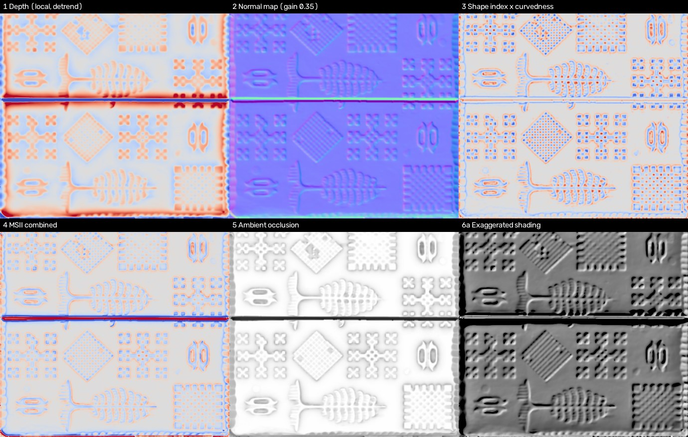

*Hình 6: Sáu phương pháp trên toàn mặt khắc, nhìn thẳng 90°.*

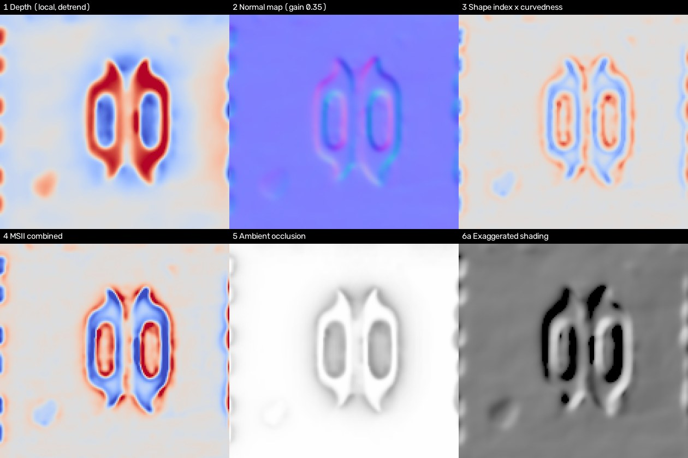

*Hình 7: Vùng zoom 50 mm do notebook tự chọn.*

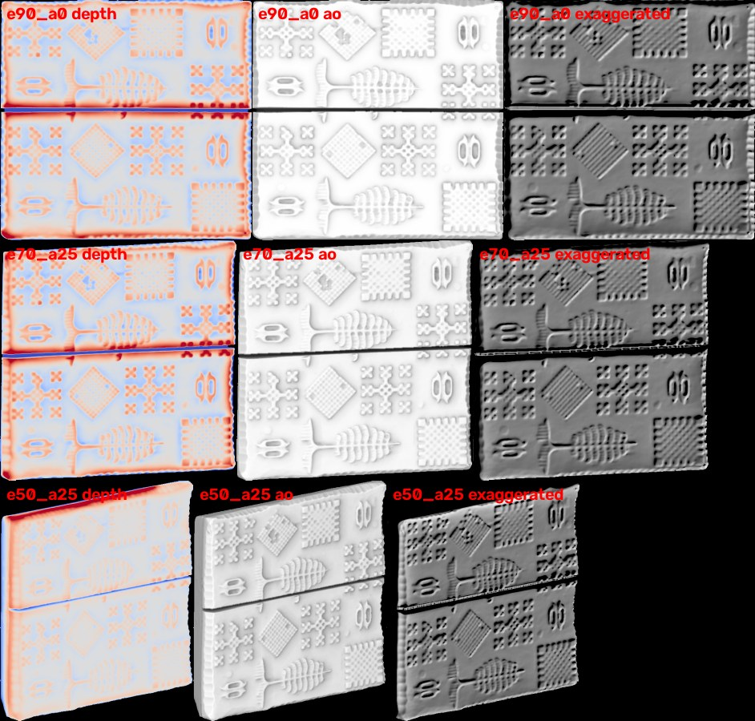

*Hình 8: Xuất hàng loạt: depth / AO / exaggerated ở 3 góc nhìn 90°, 70°, 50°. Pixel ngoài khối hoặc bị che khuất được tô đen.*

**Nhận xét:**
- Cả sáu phương pháp đều làm hoa văn hiện rõ. **AO** và **exaggerated shading** giữ nét tốt kể cả khi nhìn xiên 50°, đúng
  chỗ hướng A không làm được khi đèn thấp.
- **Độ sâu cục bộ** và **MSII** làm nổi mạnh khe nứt giữa khối, vì khe sâu hơn nét khắc nhiều lần.
- **MSII bão hoà ở bán kính nhỏ** trên scan này. Công thức xấp xỉ chỉ đúng khi `r ≳ 2 × độ sâu nét` ≈ 5 mm ≈ 16 px, nên
  các bán kính 3, 6, 12 px chỉ dùng định tính. Notebook in bảng "bão hoà" để chỉnh (phụ lục).
- Xuất hàng loạt (`BATCH_ANGLES` = 90°; 70° và 50° ở phương vị 25°; `BATCH_METHODS` = `depth`, `ao`, `exaggerated`) cho
  **9 ảnh mỗi scan**, kèm `batch_meta.json`. Không xuống 30° vì khi đó chỉ còn 77 % pixel có dữ liệu.
- `FLIP_MIRROR = True`: mộc bản khắc **ngược**, nên ảnh được lật ngang cho chữ đọc xuôi. Khối không có chữ có thể tắt.

---

## 7. Notebook Kaggle

`build_notebook.py` sinh `mocban_scan3d_kaggle.ipynb` từ hai package trong `src/core/`, ghép các file `sNN_` theo thứ tự
pipeline. Mỗi hàm là một cell, đứng sau một đoạn giải thích (làm gì, đầu vào/đầu ra, cách làm, lưu ý) lấy từ
`notebook_docs.py`. Notebook không dùng `%%writefile`.

**Builder tự kiểm tra, sai là dừng build:**
1. Các cell hàm ghép lại có **cây cú pháp (AST) giống hệt** code gốc, nên notebook không bao giờ lệch với code local.
2. **Mọi hàm/lớp đều có giải thích**; thêm hàm mà quên giải thích thì không build được.
3. Các cell chạy **không đặt biến trùng tên** hàm hoặc hằng số của thư viện.

### 7.1 Cấu trúc

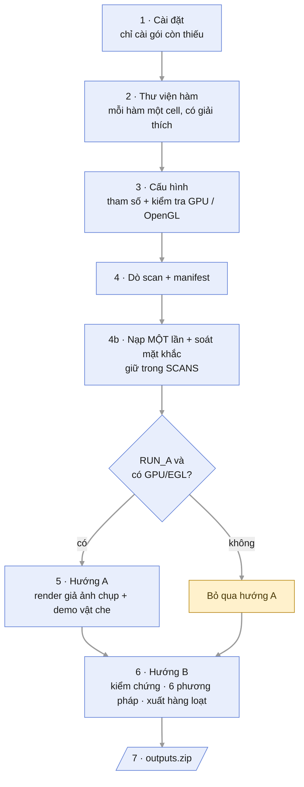

| Mục | Nội dung |
|---|---|
| 1. Cài đặt | Đặt `PYOPENGL_PLATFORM=egl` trước mọi import; chỉ cài gói còn thiếu |
| 2. Thư viện | 31 hàm/lớp của `mocban_render/` và 40 hàm của `mocban_enhance/`; mỗi mục con ứng với một file `sNN_` |
| 3. Cấu hình | Mọi tham số; in tên GPU mà OpenGL đang dùng, cảnh báo nếu đang render bằng CPU (`llvmpipe`) |
| 4. Dò scan | Tìm mesh trong `/kaggle/input`, đọc `manifest.csv` |
| 4b. Nạp + soát | Nạp **mỗi scan một lần** vào `SCANS`, soát mặt khắc, xoay mặt khắc lên +Z, ghi `audit.csv` |
| 5. Hướng A | Render `N_SHOTS` ảnh mỗi scan, in thời gian mỗi ảnh; demo vật che |
| 6. Hướng B | Kiểm chứng giải tích, chiếu nhiều góc, zoom, 6 phương pháp, lưới so sánh, xuất hàng loạt |
| 7. Đóng gói | `run_info.json` (GPU, OpenGL, thời gian từng bước) + `outputs.zip` và thống kê |

Nạp mỗi scan một lần tiết kiệm khoảng 40 s cho mỗi scan OBJ cỡ 1,42 triệu tam giác. Trước đây scan bị nạp lại ở cả ba
bước soát, A và B, mỗi lần ~20 s.

### 7.2 Tham số cấu hình

| Tham số | Mặc định | Ý nghĩa |
|---|---|---|
| `TARGET_MM` | 200 | Cạnh dài nhất của khối sau khi scale (mm) |
| `RENDER_UNCONFIDENT` | `False` | Bỏ qua scan chưa chắc mặt khắc |
| **Hướng A** | | |
| `RUN_A` | `True` | `False` để bỏ hẳn hướng A |
| `RENDER_W, RENDER_H` | 1600, 1200 | Độ phân giải ảnh |
| `N_SHOTS` | 24 | Số ảnh mỗi scan |
| `PRESET` | `"mixed"` | Hoặc một kiểu: `topdown`, `handheld`, `raking`, `closeup` |
| `OCCLUDER_PROB` | 0.0 | Xác suất thêm vật che vào mỗi ảnh |
| **Hướng B** | | |
| `SCAN` | `None` | Scan phân tích chi tiết; `None` = scan đầu tiên |
| `PX_MM` | `None` | Bước lưới ảnh độ sâu; `None` = độ phân giải gốc của scan |
| `FLIP_MIRROR` | `True` | Lật ngang cho chữ khắc ngược đọc xuôi |
| `CROP_MM` | 50.0 | Cạnh vùng zoom (mm) |
| `SIGMA0_PX`, `CURV_SIGMA` | 1.0, 1.5 | Độ trơn trước đạo hàm / khi tính độ cong |
| `MSII_RADII` | (3, 6, 12, 24, 48) | Bán kính MSII (px) |
| `AO_N_AZ`, `AO_R_PX` | 16, 24 | Số phương vị và bán kính AO |
| `LIGHT` | 35° / 135° | Hướng đèn cho exaggerated / radiance scaling |
| `ANGLES` | 90°, 70°, 50°, 30° | Góc chiếu trong phần phân tích |
| `BATCH_ANGLES`, `BATCH_METHODS` | 90°, 70°, 50° · `depth`, `ao`, `exaggerated` | Xuất hàng loạt cho mọi scan |

### 7.3 Đầu ra

```
outputs/
├── soat/
│   ├── audit.csv                     mesh, texture, face, rot90, confident, reason, ratio, auto_face, has_texture, scores
│   └── <tên>_faces.jpg               ảnh soát mặt khắc
├── A_render/
│   ├── <tên>/<tên>_XXXX.jpg          N_SHOTS ảnh mỗi scan
│   ├── <tên>/<tên>_meta.json         tham số từng ảnh: camera, đèn, hậu kỳ, pose, vật che, face_info
│   ├── <tên>_sheet.jpg               ảnh ghép xem nhanh (tối đa 16 ảnh)
│   └── occluder_demo/ …              8 ảnh DEMO vật che, không đưa vào dữ liệu huấn luyện
└── B_enhance/
    ├── 01_depth_local.png … 06b_radiance.png, grid_full.png, grid_crop.png
    └── batch/<tên>/<tên>_e<elev>_a<azim>_<phương pháp>.png + batch_meta.json
```

### 7.4 Lần chạy trên Kaggle và lỗi ảnh xám

Lần chạy đầu tiên trên Kaggle (2 × Tesla T4, ngày 24/9) chạy hết notebook không lỗi, hướng B cho số liệu trùng với máy
local. Nhưng **toàn bộ 24 ảnh hướng A ra màu xám**:

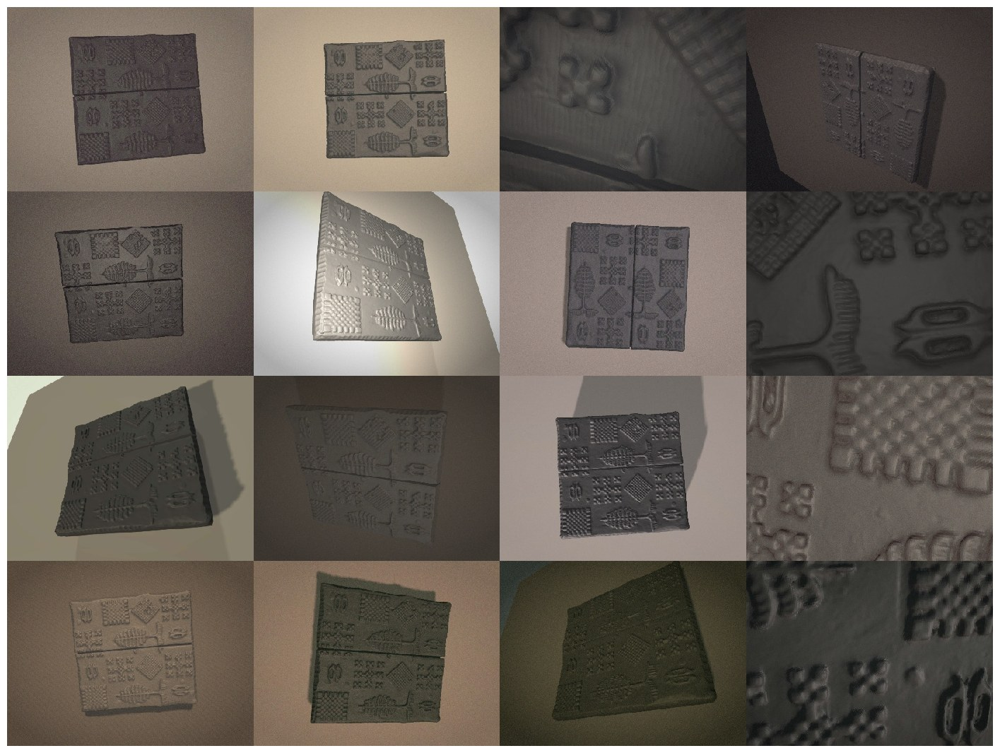

*Hình 9: Hướng A trên Kaggle, trước khi sửa: góc chụp, đèn, bóng đổ đúng nhưng khối toàn màu xám.*

**Nguyên nhân** (đã kiểm chứng): zip tải về chứa một zip lồng `source/<tên>.zip`. Kaggle giải nén cả zip lồng,
nên mesh nằm ở `source/<tên>/x.OBJ`, sâu hơn một cấp so với khi giải nén ở máy local. Hàm tìm texture cũ chỉ tìm trong
thư mục mesh và các thư mục ngang hàng, nên không tới được `textures/` ở gốc dataset.

**Cách sửa:** tìm lên tối đa 3 cấp thư mục, vòng xa bắt buộc trùng tiền tố tên (mục 4.1); dòng soát in trạng thái texture.


*Hình 10: Hướng A sau khi sửa, chạy ở máy local với đúng bố cục thư mục của Kaggle: texture gỗ và vết mực hiện đúng
(800 × 600, 6 ảnh để thử nhanh).*

**Kiểm chứng bản sửa ở máy local** (giả lập `/kaggle/input` với đúng bố cục zip lồng, thêm một scan GLB texture nhúng):

| Kiểm tra | Có GPU | Không GPU |
|---|---|---|
| Chạy hết notebook | không lỗi, 86 s cho 2 scan | không lỗi, 62 s |
| Texture | OBJ: tìm được ảnh texture rời; GLB: nhúng sẵn | như bên trái |
| Mặt khắc | cả 2 scan `C-`, tin cậy (8,7× và 8,6×) | như bên trái |
| Hướng A | 6 ảnh mỗi scan, ~0,55 s/ảnh, có màu gỗ | tự bỏ qua, không lỗi |
| Kiểm chứng giải tích | 20/20 | 20/20 |
| Hướng B | trùng số liệu lần chạy Kaggle (597 × 625, 98,8 % valid, độ sâu nét 2,529 mm, cùng vùng zoom) | như bên trái |

Kiểm tra thêm: bố cục thư mục cũ vẫn tìm đúng texture; hai scan chung một dataset không nhặt nhầm texture của nhau;
manifest ghi tên texture vẫn tìm được ở bố cục lồng; bộ kiểm thử tìm mặt khắc 13/13 đạt (mục 4.3).

**Chạy lại trên Kaggle (25/09) với bản đã sửa: hết lỗi ảnh xám.**

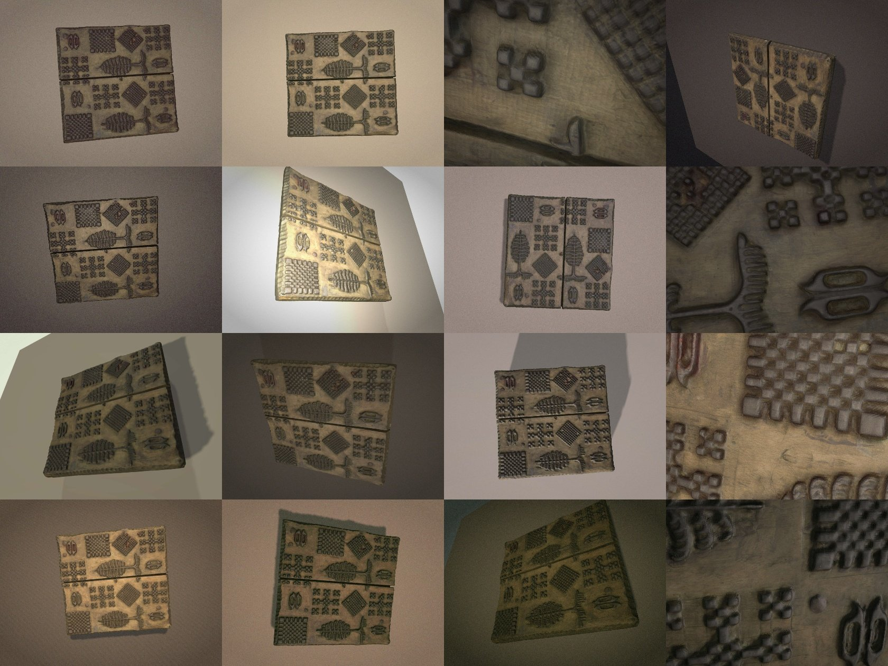

*Hình 11: 16/24 ảnh hướng A của lần chạy lại trên Kaggle: texture gỗ và vết mực hiện đúng ở mọi kiểu chụp.*

| Kiểm tra | Kết quả trên Kaggle |
|---|---|
| Soát mặt khắc | tìm được texture rời (`has_texture = True`); mặt `C-`, tin cậy, 8,7× (0,220 mm so với 0,025 mm), giống máy local |
| Hướng A | đủ 24 ảnh 1600 × 1200, có màu gỗ; kiểu chụp: handheld 9, topdown 7, closeup 7, raking 1; demo vật che 8 ảnh |
| Hướng B | trùng máy local: 0,321 mm/px, ảnh 597 × 625; pixel có dữ liệu 98,8 % / 93,9 % / 84,0 % ở 90° / 70° / 50° |

**Tốc độ render trên Kaggle: OpenGL đang chạy trên CPU.** Notebook ghi mọi số đo vào **`run_info.json`** trong
`outputs.zip` (GPU theo `nvidia-smi`, renderer OpenGL, thời gian từng bước). Lần chạy 25/09:

| Số đo | Kaggle | Máy local |
|---|---|---|
| GPU của máy | 2 × Tesla T4 | GTX 1660 Ti + Intel UHD 630 |
| Renderer OpenGL | **`llvmpipe` (Mesa, render bằng CPU)** | Intel UHD 630 (GPU tích hợp) |
| Render hướng A, 1600 × 1200 | 24 ảnh: dựng cảnh 0,86 s + render 106 s = **4,42 s/ảnh** | ~0,6 s/ảnh |
| Nạp scan / nạp + soát | 6,7 s / 18,4 s | 17–23 s / ~30 s |
| Xuất hàng loạt hướng B (9 ảnh) | 6,2 s | 7,5 s |
| Tổng thời gian notebook | 190 s | |

Máy Kaggle có GPU (`nvidia-smi` thấy đủ 2 × T4), nhưng EGL không tới được driver đồ hoạ của NVIDIA, nên pyrender rơi
về render phần mềm. Ảnh vẫn đúng, chỉ chậm khoảng 7 lần. Nguyên nhân cụ thể **chưa kiểm**: có thể container thiếu thư
viện EGL của NVIDIA (`libEGL_nvidia`), hoặc chỉ được cấp quyền tính toán mà không có quyền đồ hoạ.

---

## 8. Tổng hợp các lỗi đã sửa

| Lỗi | Hậu quả | Cách sửa |
|---|---|---|
| `force="mesh"` khi nạp file | mất texture, render ra xám (ảnh hưởng cả file GLB tải về) | `process=False` + gắn texture rời |
| OBJ không có `.mtl` được trimesh gán ảnh 2×2 | bước tự tìm texture bị bỏ qua | bỏ qua ảnh < 16 px |
| Tìm texture chỉ ở thư mục mesh và thư mục ngang hàng | ảnh xám trên Kaggle do zip lồng | tìm lên 3 cấp, bắt buộc trùng tiền tố tên |
| Xác định hướng khối bằng AABB | scan đặt nghiêng bị chọn theo đường chéo | dùng OBB |
| Ma trận hoán trục có det = −1 | khối bị **lật gương**, chữ sẽ bị đảo | ép det = +1 |
| Không phân biệt mặt `+` hay `−` | có thể render mặt lưng | chấm điểm detail bằng trung vị phần dư |
| Tính độ phủ bằng phép giãn | mảnh vụn phình to, mặt rỗng được coi là có dữ liệu | dùng phép đóng; chỉ xếp hạng mặt có độ phủ ≥ 50 % |
| Chiếu bằng rải điểm | hố giả 14–35 mm, độ sâu nét bị thổi phồng 2,4 lần | rasterize tam giác tại tâm pixel |
| Đo độ sâu nét bằng p1–p99 | bị khe nứt sâu làm phồng số đo | dùng p5–p95 |

## 9. Hạn chế

1. **Mới kiểm chứng trên 1 scan thật, và scan đó là hoa văn, không có chữ.** Các ngưỡng tìm mặt khắc (0,6 / 2× / 50 % /
   15 %) là giá trị đặt thử, cần hiệu chỉnh khi có thêm scan. Với khối gần lập phương, biên độ giữa các mặt hẹp (2,1× so
   với ngưỡng 2×).
2. **Hướng 0°/180° trong mặt phẳng** không tự xác định được, phải chỉnh tay bằng `rot90`.
3. **Chưa đo độ giống thật** của ảnh render so với ảnh chụp mộc bản thật (ví dụ so phân bố độ sáng, độ tương phản nét,
   phổ nhiễu với các bộ ảnh chụp thật).
4. **Vật che còn là hình học đơn giản** (ellipse, dải màu), chưa phải patch cắt từ ảnh thật.
5. Hướng A cần OpenGL/EGL; không có renderer dự phòng. **Trên Kaggle, OpenGL đang chạy trên CPU (`llvmpipe`)** dù máy
   có 2 × T4, nên render chậm ~4,4 s/ảnh. Với 24 ảnh mỗi scan thì chấp nhận được, nhưng sinh hàng nghìn ảnh sẽ rất lâu.
6. Hàm chấm điểm mặt `_face_height` vẫn dùng rải điểm. Điều này chấp nhận được vì hàm chỉ lấy trung vị làm điểm số, và
   các bài kiểm của nó đều đạt. **Không dùng lại hàm này để tạo ảnh.**
7. Các tham số mặc định của hướng B chọn theo nét hoa văn to và sâu 2,5 mm. Nét chữ Hán nhỏ và nông hơn, nên `MSII_RADII`
   và `AO_R_PX` nhiều khả năng cần giảm. Đây là đề xuất, chưa kiểm chứng.

## 10. Việc tiếp theo

1. **Cho EGL trên Kaggle dùng được GPU T4**, hoặc chấp nhận render bằng CPU. Việc đầu tiên: kiểm trong container xem có
   `libEGL_nvidia` và file khai báo EGL vendor của NVIDIA không, và biến `NVIDIA_DRIVER_CAPABILITIES` có chứa `graphics`
   không. Nếu container không có thư viện đồ hoạ thì không sửa được từ notebook; khi đó chỉ còn cách chia nhỏ việc sinh
   ảnh, hoặc render ở máy có GPU.
2. **Tìm thêm scan**, ưu tiên khối có chữ. Đã có vài scan khối in có chữ được chia sẻ công khai làm ứng viên; các trang
   này thường bắt đăng nhập nên phải tải tay. Có thêm scan thì chạy `audit_scans.py` để hiệu chỉnh ngưỡng.
3. **Nếu có scan mộc bản Hán-Nôm**, cần nhãn chữ cho ảnh render. Hướng khả thi: gắn nhãn một lần trên ảnh nhìn thẳng (ảnh
   độ sâu 90° của hướng B), rồi chiếu nhãn sang mọi khung hình bằng pose camera đã lưu trong `meta.json`.
4. **Đo độ giống thật**: so thống kê ảnh render với ảnh chụp mộc bản thật trước khi sinh số lượng lớn.
5. **Dùng đầu ra hướng B** làm kênh phụ hoặc ảnh tiền xử lý khi huấn luyện, rồi so với ảnh chụp thường.

---

## Phụ lục: Chỉnh tham số cho scan mới

1. Chạy notebook với tham số mặc định.
2. Đọc các con số notebook in ra ở hướng B: **độ sâu nét điển hình** (`RELIEF_MM`), `PX_MM`, bảng "bão hoà" của MSII.
3. Chỉnh theo bảng:

| Tham số | Quy tắc chỉnh | Scan mẫu |
|---|---|---|
| `MSII_RADII` | Bỏ bán kính bị đánh dấu "bão hoà"; bán kính nhỏ nhất ≈ `2 × RELIEF_MM / PX_MM` | nét 2,5 mm, 0,32 mm/px → từ ~16 px; giữ 24, 48 |
| `AO_R_PX` | Chọn trong 3 ảnh quét 8 / 24 / 72 px mức cho rãnh rõ nhất; nét nhỏ (chữ) thì giảm, hoa văn lớn thì tăng | 24 px |
| `SIGMA0_PX` | Tăng nếu ảnh độ cong / MSII còn lưới tam giác hoặc hạt nhiễu | 1 px |
| `CROP_MM` | Vừa với 3–5 chữ hoặc 1–2 hoạ tiết | 50 mm |
| `FLIP_MIRROR` | `True` với mộc bản chữ (khắc ngược) | `True` |
| `TARGET_MM` | Đặt đúng kích thước thật của khối nếu biết | 200 mm |
| `N_SHOTS`, `PRESET`, `OCCLUDER_PROB` | Tăng `N_SHOTS` khi sinh dữ liệu thật; chọn `PRESET` theo kiểu ảnh cần bổ sung | 24, `mixed`, 0 |
| `face` / `rot90` / `texture` | Sửa trong `manifest.csv` khi scan bị đánh dấu cần soát (mục 4.4) | không cần |
